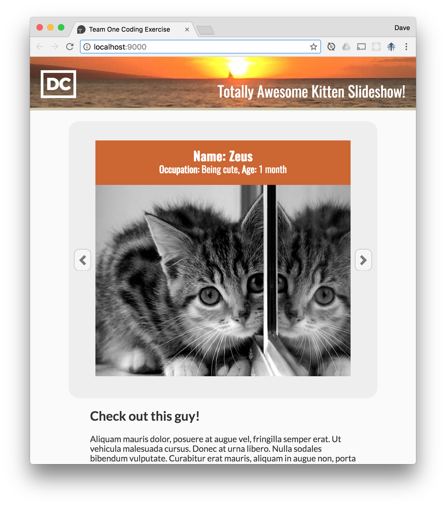
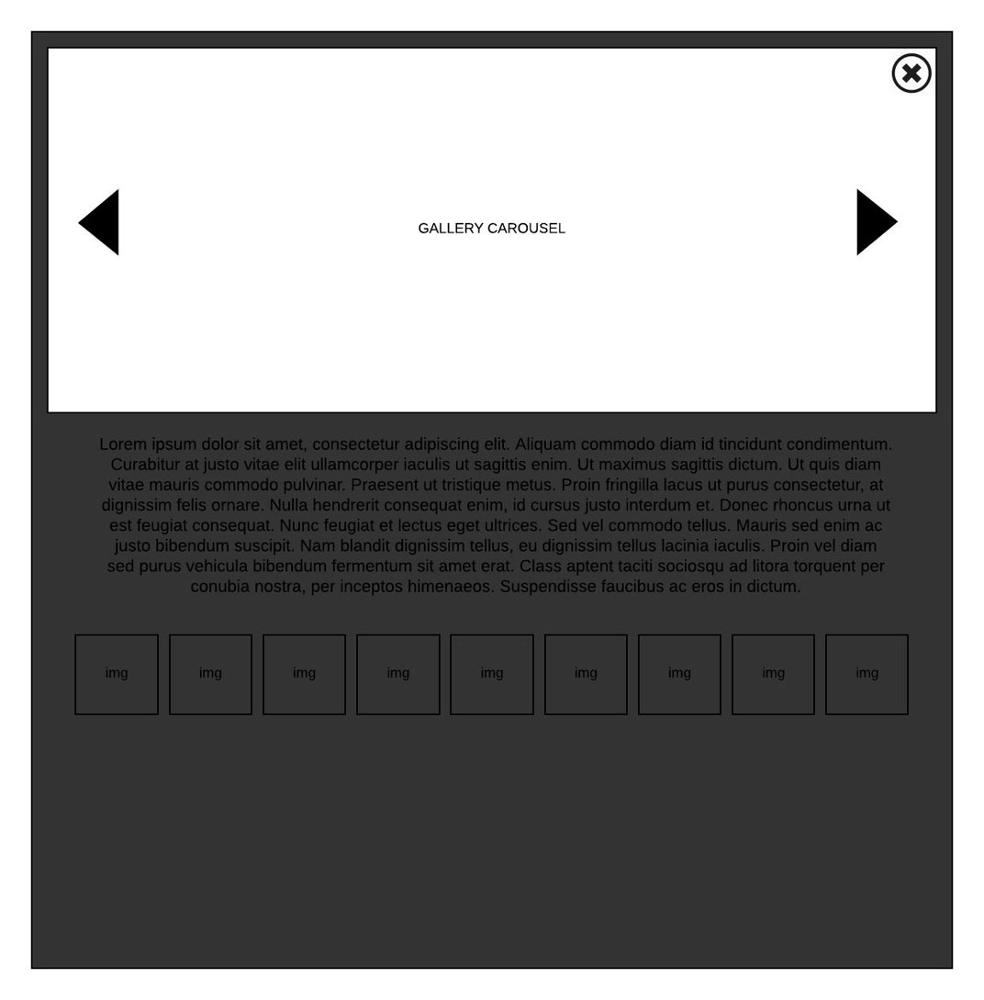

# Team One UI Coding Exercise

> This project is being submitted to the Team One development team to be considered and evaluated as a web app coding proficiency exercise. The content used pays homage and respect to a [image placeholder service](http://www.placekitten.com) used by many developers and has become a modern classic.

## Introduction

When asked to advance to the second stage of the interview process for an open Senior Web Developer position, Lead UI Architect Rodolfo Dengo provided me with the following UI Code Exercise assignment requirements: 

### Requirements:

#### General

- Reset CSS is allowed
- Responsive CSS is required
- NO CSS frameworks (bootstrap, Zurb etc)
- Jquery Allowed but Vanilla JS preferred
- NO jQuery Plugins.
- Build System (Gulp, Grunt, Webpack) Allowed and encouraged
- NO JS frameworks (vue, ember, knockout, angular, backbone, etc)

#### Hero Carousel

- Slide between images 3-5 images
- Each image should have a title and description in html text centered both horizontal and
vertical over the image.
- The carousel should wrap
	- If you click next to the last item clicking next should slide to the 1st item.
If you click previous to the first item and click previous it should slide to the last
item.

#### Thumbs

- On click the thumb should open an overlay (modal) and display a carousel of all images
in the thumb gallery opened to the image you clicked.

#### Gallery Carousel

- The carousel should not wrap
	- If you click next to the last item the next should be disabled.
	- If you click previous to the first item the previous should be disabled.

#### Considerations

Design: Overall design and image choices and transitions are up to you and will be part of the
evaluation.

Documentation: Documentation style is up to you and will be part of the evaluation.

#### Wireframes

#### The Result

The files in this repository comprise the completed UI Code Exercise web application, created by adhering to the provided requirements outlined above. Please download/clone and install the application using the following instructions in the next section. Once downloaded and installed, please run the application for evaluation as the completed photo gallery exercise. The source code created during development (in the `app` directory) and the final compiled, optimized, published build (int he `dist` directory) have both been provided. 

The final directory structure of the published application in the `dist` directory is illustrated here in the following screen shot:

As per the provided requirements, the functionality of the app was written using only "Vanilla" Javascript, without the use of jQuery or the assistance of plugins or popular Javascript libraries and frameworks such as React. The photo slider animations are handled with CSS3, keeping the load time and total file size as low as possible. The page is responsive, with page rendering that will adapt and is optimized for mobile, tablet and desktop views. 

## Installation, Running and Previewing the App

To get a preview of the [final compressed and compiled build of the application](http://teamone.davechurilla.com), I have hosted a current copy of it on my personal web host, [here](http://teamone.davechurilla.com). To do a full review of the source code assets, you will need to follow the instructions below. This will also give you the ability to run the application locally with Node and Gulp.

The quickest way to get this project set up is to clone this repository and install it onto your local drive using Node Package Manager. You will need to have Node installed (NPM is bundled with the install), along with global install of both Gulp and Bower. With Node installed, you can install Gulp and Bower in one simple step. Using Terminal on a Mac, or Command Prompt in Windows, run this: `npm install --global gulp-cli bower`. Once this is done, you will be able to install all project dependencies and run the application locally. Here are a few steps to get started:

- `cd` into the directory you just cloned to your local drive. It will be called Team-One-exercise.
- While in the project directory in command line, run `npm install`. You need to run this as administrator in order to install without running into errors. On a Mac, you should run this command as `sudo npm install`. You will need to provide a password to continue (same password you use to login to your Mac). This will take a few minutes, as there are several Node packages installed with [this particular web app scaffold](https://github.com/yeoman/generator-webapp).
- run `bower install`
- All packages and dependencies should be installed at this point. To run the application: `gulp serve`. This will run the application in your browser at http://localhost:9000 from the 'app' directory, which contains all of the source code files. These will be the files that should be reviewed and evaluated for coding proficiency.
- The files in the `dist` directory comprise the compiled build of the project. These files can be dropped into the root directory of a server and the completed app can also be reviewed in this way. 

## Development Tools and the Code

When getting started on this project, I first set up a development environment using a Yeoman generator to scaffold a base webapp. This includes an HTML5 boilerplate setup, with helpers and front-end tools commonly used in a Node development environment. For details and a list of features for the webapp generator, [visit the Github page](https://github.com/yeoman/generator-webapp).

### Tools and Resources

Tools used in webapp include:

- libsass: Preprocessor used for dynamic CSS authoring written in the SCSS syntax. 
- JSLint: Javascript testing and validation used throughout the development process, and when creating build of the app.
- Normalize.css: Reset CSS for consistency and cross-compatibility of styles across browsers.
- Gulp: Task manager that runs testing and optimization tools when watching, and on final build. Live reload runs while watching files and will validate code and launch/refresh browser at localhost:9000 on each save.
- htmlmin, cssnano, uglify, imagemin - Optimization tools for compression of files when creating a build.

The fonts used on the page were downloaded from Google Fonts and converted using the Font Squirrel website. All font file types needed for full browser cross-compatibility are imported into the main SCSS file as a dependency. Lastly, I think it goes without saying the source used for the images featured in the galleries  [PlaceKitten.com](http://www.placekitten.com)

### HTML5

Clean, simple and standards-compliant mark-up was written first to frame up the structure of the page. Use of the semantic HTML approach results in clearly delineated code that will help with ease of readability and editing. Type, order, and names of tags, along with organized commenting and spacing in code all contribute to ahereance to a standard that makes for scalable, clean HTML. Organized naming convention for IDs and class names create efficiency for next steps of authoring the CSS and Javascript code.

One thing to note are the comment blocks in `app/index.html` around the references to the Javascript and the CSS dependencies that look similar to this: `<!-- build:js scripts/main.js -->` and `<!-- endbuild --> `. These are used in the build step of the Gulp tasks to indicate which CSS and Javascript files to concatenate and compress into bundled files. The final compressed build files are copied over to the `dist` directory once they're processed, and paths in the HTML output are adjusted to reference the new files.

The final build HTML has been thoroughly tested and passes [W3C validation](https://validator.w3.org/) with no errors. 

### CSS3

CSS authoring was written using SCSS syntax, using libsass as the preprocessor as part of the steps in the Gulpfile when the files are watched or when a build is created. The output is cross-compatible CSS which will render correctly in current browsers and devices. The autoprefixer option is used in the Gulpfile to add vendor prefixes to CSS rules so CSS3 properties will render properly in slightly older browser versions.

The web fonts used on the project page were downloaded from Google fonts, converted (using Font Squirrel), and imported as dependencies into the `main.scss` file. The font file types used are ttf, woff, woff2, svg and eot. All converted web font files are hosted in the `fonts` directory and imported using SCSS in the `app/styles//font.scss` file.

### Javascript

Only "Vanilla" Javascript was used for the development of this web application, without the assistance of jQuery, plugins, or additional Javascript libraries. Functionality of the photo gallery slider is written in `app/scripts/main.js`. Some additional global helper functions are defined in the `app/scripts/global` file. Upon `gulp build`, both files are validated, compressed and concatenated into one bundled file and then output to `dist/scripts/main.js`. Modernizr is also used to test for supported browser features. It is referenced in the head of the HTML file so all helper functions are available for use before the page DOM is loaded. 

JSLint is used for testing and validation of the scripts throughout development and in the final build. Scripts passed the linter tests with no errors and are compliant to coding standards and best practices.

As with the source HTML and SCSS files, the Javascript code is written in a clean, organized format with plenty of helpful comments that explain each section of the scripts for ease and reading, testing and future updates.

## Final Thoughts

The completed application has been tested in current versions of all popular modern browsers and devices. Browsers consderied are current versions of the following: Chrome, Firefox, Safari (for Mac only), Internet Explorer 11+ (Windows only), iOS, and Android. The photo gallery functionality and transition animations work in everything and throw no errors.

Page load time is minimal since all assets have been concatenated, compressed, and bundled for full optimization. To quickly view the complete and final build, point your browser to [this subdomain](http://teamone.davechurilla.com) on my personal server.

Please feel free to contact me with any questions or comments at my personal email: churilla@gmail.com. Thank you for your time and your consideration!

## About the Author

<table>
	<tr>
		<td style="padding: 0 20px 20px;" width="25%" valign="top"></td>
		<td valign="top">
			I am a successful technology professional with proven experience in front end web application development. My primary role on previous projects was full stack front end development, working on large enterprise-level websites for Mattel, Toyota, AARP and Bloomin’ Brands.
			Below is an overview of some of my strengths and accomplishments:
			<ul>
				<li>User Interface Development: Possess over 15 years in the field of front end web development with an extensive knowledge of coding standards and best practices for cross-compatibility between popular browsers and devices. Expertise includes mastery-level knowledge of HTML5, CSS3/SASS, JavaScript, including current JavaScript frameworks and libraries. Managed front-end integration into ASP.NET MVC project environments, working closely with .NET engineers. Performed thorough end-to-end testing, troubleshooting, and bug fixes prior to launch. Positioned as front end tech lead and contributor for enterprise-level, full stack development of responsive websites and landing pages for Toyota, Mattel, Roy’s Restaurant, Fleming’s Steakhouse, and the RAPP 
				company website.</li>
				<li>HTML Email Development: Subject matter expert of standards and best practices for responsive HTML email development. Performed testing and QA in all current email environments such as Outlook, Gmail and Yahoo as standard process work flow before deployment of all emails. Set up final email assets for deployment using Salesforce Marketing Cloud for segmentation, A/B testing, and populating dynamic content based on user data and click behavior. Excelled as front-end team lead and contributor, delivering hundreds of email campaigns for AARP, Toyota and Bank of America.</li>
				<li>Team Management: Managed a team of front end developers with the focus on creating and delivering assets for AARP CRM campaigns. Adhered to a very strict set of standards for consistency and compatibility across all email clients. Organized and hosted weekly check-in meetings with the team to discuss status of projects. Performed regular code reviews, while enforcing established coding standards for all final deliverables.</li>
			</ul>
			 Please review [my portfolio](http://portfolio.davechurilla.com) and [download my resume](http://portfolio.davechurilla.com/DAVE_CHURILLA_Resume.pdf) for more details regarding my experience and skills. My current contact information can be found on my resume as well. Thanks again!
		</td>
	</tr>
</table>