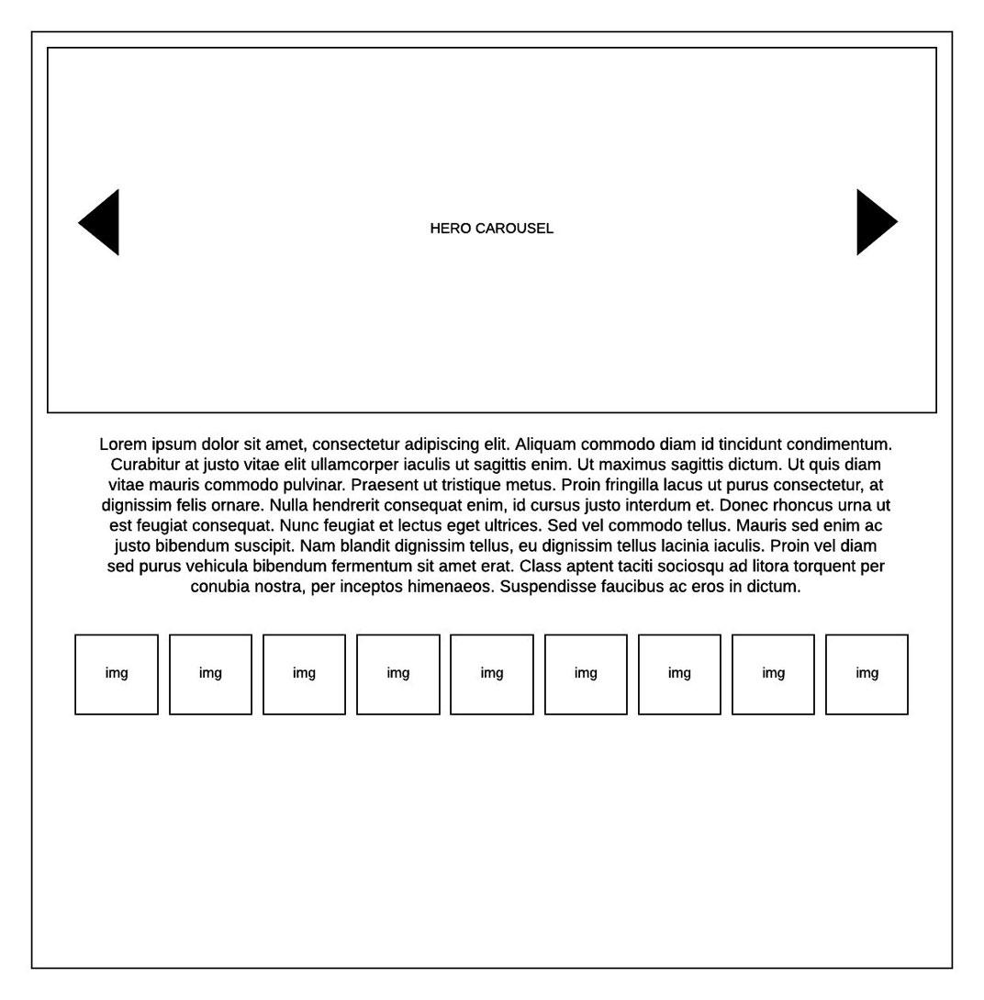
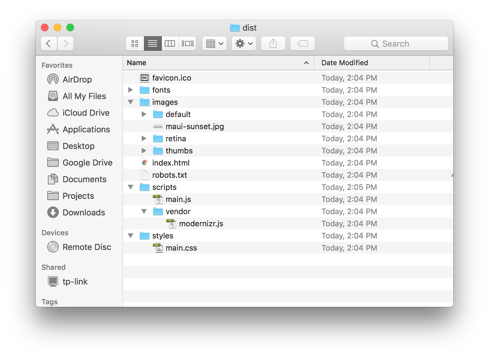

# Team One exercise

> This project is being submitted to the Team One development team to be considered and evaluated as a web app coding proficiency exercise. The content useed pays homage and respect to a [image placeholder service](http://www.placekitten.com) used by many developers and has become a modern classic.

## Introduction

When asked to advance to the second stage of the interview process for an open Senior Web Developer position, Lead UI Architect Rodolfo Dengo provided me with the following UI Code Exercise assigmnent requirements: 

### Requirements:

#### General

- Reset CSS is allowed
- Responsive CSS is required
- NO CSS frameworks (bootstrap, Zurb etc)
- Jquery Allowed but Vanilla JS preferred
- NO jQuery Plugins.
- Build System (gulp, grunt, webpack) Allowed and encouraged
- NO JS frameworks (vue, ember, knockout, angular, backbone, etc)

#### Hero Carousel

- Slide between images 3-5 images
- Each image should have a title and description in html text centered both horizontal and
vertical over the image.
- The carousel should wrap
	- If you click next to the last item clicking next should slide to the 1st item.
If you click previous to the first item and click previous it should slide to the last
item.

#### Thumbs

- On click the thumb should open an overlay (modal) and display a carousel of all images
in the thumb gallery opened to the image you clicked.

#### Gallery Carousel

- The carousel should not wrap
	- If you click next to the last item the next should be disabled.
	- If you click previous to the first item the previous should be disabled.

#### Considerations

Design: Overall design and image choices and transitions are up to you and will be part of the
evaluation.

Documentation: Documentation style is up to you and will be part of the evaluation.

#### Wireframes

#### The Result

The files in this repository comprise the completed UI Code Exercise web appication, created by adhereing to the provided requirements outlined above. Please download/clone and install the application using the following instructions in the next section. Once downlaoded and installed, please consider the running application for evaluation of the completed photo gallery exercise. The source code created during development and the final compiled, optimized, published build have been provided. 

The final directory structure of the published application is illustrated here in the following screen shot:

## Installation, Running and Previewing the App

Etiam suscipit massa mauris, ut interdum neque bibendum nec. Nullam facilisis urna vel nisl euismod, eget blandit mauris congue. Vivamus et hendrerit risus. Praesent facilisis ex sit amet ipsum interdum lacinia. Donec sollicitudin ultrices ligula at gravida. Sed mollis purus a massa tristique finibus. Mauris a bibendum elit, sed auctor enim. Duis et metus elit. Sed quis quam fermentum, mattis ex eu, consectetur leo. Suspendisse potenti.

## Development Tools and the Code

Morbi non sollicitudin lectus. Duis sit amet elit luctus, ornare mauris et, porttitor dolor. Duis fermentum ex vel gravida accumsan. Maecenas finibus felis sit amet dolor hendrerit tristique. Phasellus a dictum est, quis placerat nisl. Sed sed metus laoreet lectus dictum bibendum. In tincidunt consequat molestie.

### Tools and Resources

Aenean ornare sapien et tempus cursus. Integer tincidunt ipsum non ante luctus laoreet. Donec ut interdum nisl, a laoreet elit. Aenean vitae iaculis sem, in aliquam dui. Sed lectus ligula, ultricies quis malesuada non, bibendum non dolor. Pellentesque gravida dolor et vehicula egestas. Nam non nisi tempor, laoreet ante sed, tincidunt ante. Nullam cursus mi ac placerat blandit. Mauris ultricies risus vel ullamcorper molestie. Phasellus non dapibus arcu.

### HTML5

Pellentesque lectus felis, auctor porttitor sem ut, rhoncus tristique dolor. Etiam pulvinar elit quis massa cursus euismod. Aliquam in euismod lorem, in sagittis urna. Morbi ut ligula lorem. Fusce auctor sodales nunc, vitae dictum nibh fermentum eleifend. Suspendisse ornare feugiat felis non pellentesque. Vivamus sit amet elit non magna ultricies lacinia ac quis massa.

### CSS3

Maecenas eget ex quis tellus placerat scelerisque. Curabitur laoreet orci sed dolor finibus, sit amet dignissim felis iaculis. Quisque lacinia eu erat a tempus. Mauris lobortis sapien eget leo viverra, a volutpat ante efficitur. Vestibulum sit amet lectus luctus nisl sollicitudin vehicula. Curabitur mi nibh, euismod sit amet posuere sed, auctor dignissim velit. Nam viverra diam id velit ultricies, a tristique nibh semper. 

### Javascript

Nulla et posuere justo. Suspendisse quis lacus odio. Proin imperdiet est ac mi accumsan convallis. Curabitur sed tempor nisi. Maecenas sodales dui ut volutpat iaculis. Duis fermentum dui urna. Praesent iaculis dolor posuere leo egestas sagittis at nec lacus. Vestibulum venenatis nisi nec arcu pellentesque, vel vulputate ipsum placerat. Pellentesque tempus vitae nisl ut ullamcorper. Suspendisse potenti. Vivamus dui tellus, tempor vel metus in, hendrerit iaculis dolor.

## Final Thoughts

Aliquam dignissim sed leo vitae ultrices. Nullam nisl ante, scelerisque vitae metus at, hendrerit dictum lectus. Fusce euismod felis eget velit iaculis varius. Curabitur vel tellus massa. Duis et tortor nulla. Class aptent taciti sociosqu ad litora torquent per conubia nostra, per inceptos himenaeos. Nam sodales mauris in sollicitudin scelerisque. Maecenas elit mauris, ullamcorper at ornare vel, tincidunt nec magna. 

## About the Author

<table>
	<tr>
		<td style="padding: 0 20px 20px;"></td>
		<td valign="top">Vivamus quam orci, mollis ac leo ornare, varius gravida metus. Nulla ut mauris posuere urna condimentum tempor. Praesent et sem urna. Praesent consectetur erat nec mauris elementum, eu maximus odio faucibus. Vestibulum ante ipsum primis in faucibus orci luctus et ultrices posuere cubilia Curae; Sed varius posuere nisi quis eleifend. Donec viverra felis id mi elementum venenatis. Nam feugiat, quam id mattis fringilla, dolor tortor ultricies nibh, eu vehicula mauris est a velit.</td>
	</tr>
</table>

